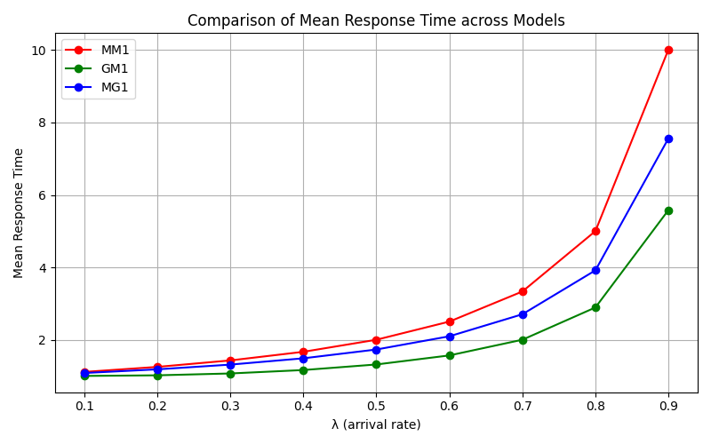
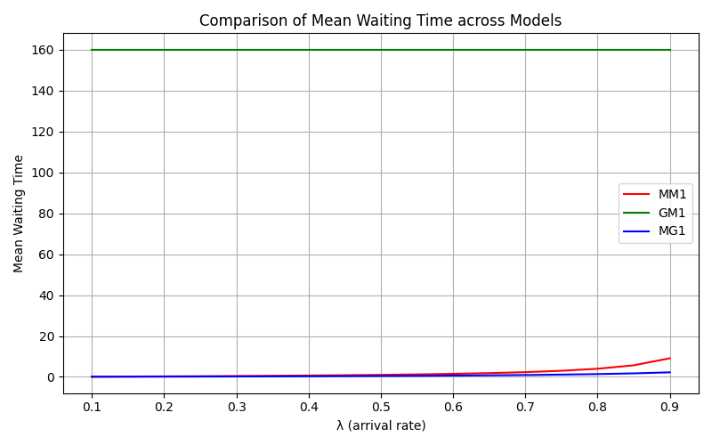
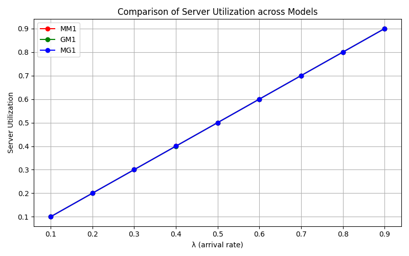

# Simulation et Analyse des Files d’Attente – M/M/1, G/M/1, M/G/1

Ce projet Python a pour objectif de simuler et analyser les performances de trois modèles fondamentaux de files d’attente mono-serveur :

- `M/M/1` : arrivées et services exponentiels.
- `G/M/1` : arrivées générales (uniformes), services exponentiels.
- `M/G/1` : arrivées exponentielles, services généraux (Weibull).

Il s’inscrit dans le cadre d’un travail pratique de modélisation et simulation à l’université (L3 Informatique Sécurité, USTHB), et met en œuvre une simulation événementielle discrète pour étudier l’impact de la variabilité sur les temps de réponse et d’attente dans un système.

## 📂 Structure du projet

```bash
.
├── main.py                    # Script principal de simulation
├── simulate_mm1.py           # Implémentation du modèle M/M/1
├── simulate_gm1.py           # Implémentation du modèle G/M/1 (arrivées uniformes)
├── simulate_mg1.py           # Implémentation du modèle M/G/1 (services Weibull)
├── common/
│   ├── simulation_utils.py   # Fonctions utilitaires de simulation
│   └── plot_utils.py         # Fonctions de visualisation des résultats
├── plots/                    # Graphiques générés (.png)
├── results/                  # Résultats bruts (.csv)
└── README.md                 # Documentation du projet
```

## 🎯 Objectifs pédagogiques

- Implémenter un simulateur événementiel discret.
- Comparer empiriquement des modèles de files d’attente sous différentes hypothèses.
- Mettre en évidence l’impact de la régularité des arrivées ou de la variabilité des services.
- Valider les simulations en les confrontant aux résultats théoriques du modèle M/M/1.

## 🧮 Modèles simulés

### ✅ M/M/1
- Arrivées selon un processus de Poisson (temps inter-arrivées exponentiels).
- Services exponentiels.
- Comparaison avec les résultats théoriques connus :
  \[
  W = rac{1}{\mu - \lambda}, \quad W_q = rac{\lambda}{\mu(\mu - \lambda)}, \quad 
ho = rac{\lambda}{\mu}
  \]

### ✅ G/M/1
- Arrivées régulières simulées via une loi uniforme.
- Services exponentiels.
- Mise en évidence de la réduction du temps d’attente grâce à la moindre variabilité des arrivées.

### ✅ M/G/1
- Arrivées exponentielles.
- Services selon une loi de Weibull (modélise la variabilité des services).
- Analyse de l’impact de services irréguliers (queue longue) sur les délais.

## ⚙️ Paramètres de simulation

| Paramètre               | Valeur                                 |
|------------------------|----------------------------------------|
| Nombre de clients      | 1 000 000                              |
| Taux de service ($\mu$)| 1.0                                   |
| Taux d’arrivée ($\lambda$) | De 0.1 à 0.9 (pas de 0.1)          |
| Répétitions            | 100 par valeur de $\lambda$            |
| Mesures observées      | Temps d’attente, temps de réponse, utilisation |

## 📊 Résultats & Visualisation

Les graphiques produits montrent :

### ✔️ Validation du modèle M/M/1
- Superposition entre les courbes simulées et théoriques.
- Faible erreur absolue (inférieure à 0.02), même pour $\lambda \to 0.9$.

### ✔️ Comparaison croisée

1. **Temps de réponse moyen**  
   

2. **Temps d’attente moyen**  
   

3. **Utilisation du serveur**  
   

## 📌 Enseignements clés

- Le modèle G/M/1, avec des arrivées régulières, est le plus performant.
- Le modèle M/G/1 est le plus pénalisé par la variabilité des services.
- Le modèle M/M/1 constitue une référence analytique utile, mais sensible à la saturation.

## 🧠 Extensions possibles

- Support des modèles multi-serveurs (M/M/s, M/G/s).
- Détection automatique de la phase transitoire.
- Génération de rapports PDF automatisés avec LaTeX.
- Interface interactive avec Streamlit ou Dash pour expérimenter les paramètres.

## ▶️ Exécution

```bash
# Pour simuler et tracer les résultats M/M/1
python main.py --model mm1

# Pour comparer les trois modèles
python main.py --compare all
```

## 🧪 Dépendances

- `numpy`
- `pandas`
- `matplotlib`
- `scipy`

Installation rapide :
```bash
pip install -r requirements.txt
```

## 👨‍💻 Auteur

Projet réalisé par **[Votre Nom]** dans le cadre du module *Modélisation & Simulation* (L3 ING SEC, USTHB 2025).

## 📄 Licence

Ce projet est distribué sous licence MIT. Vous êtes libre de l’utiliser, modifier ou redistribuer avec attribution.